# 유용한 AI 3D 생성 도구

> [Hey Dream AI](https://heydream.im/) 팀의 프로젝트입니다.

[简体中文](README_zh.md) · [English](README_en.md) · [繁體中文](README_tw.md) · [日本語](README_ja.md) · [한국어](README_ko.md) · [Deutsch](README_de.md) · [Français](README_fr.md) · [Español](README_es.md) · [Português](README_pt.md) · [Italiano](README_it.md) · [Русский](README_ru.md) · [العربية](README_ar.md) · [Bahasa Indonesia](README_id.md) · [ไทย](README_th.md) · [Tiếng Việt](README_vi.md)

17개 제품의 스크린샷, 링크, 활용법을 소개하는 한국어 요약판입니다. 자세한 내용은 중국어 가이드를 참고하세요.

[중국어 전체 가이드](README_zh.md)

## 트래픽과 표시 순서

트래픽 기준월: 2026-07. 업데이트: 2026-09-08. 방문 수는 추정치이며 사용자 수나 품질 점수가 아닙니다. 13개 제품은 SeekTool의 재인용 자료를 사용합니다. HeyDream과 See3D는 요청에 따라 3·4번째로 표시하며 확인되지 않은 트래픽은 N/A입니다. Spline은 출처 기준이 다르고 Hunyuan3D는 비교 가능한 수치가 없어 순위를 매기지 않습니다.

| 표시 순서 | 트래픽 순위 | 제품 | 월 방문 수 |
| --- | --- | --- | ---: |
| 1 | 1 | [Meshy](https://www.meshy.ai/) | [25.2M](https://cf-preview.seektool.ai/pt/ranking/categories/ai_3d_model_generator) |
| 2 | 2 | [Tripo AI](https://www.tripo3d.ai/) | [23.2M](https://cf-preview.seektool.ai/ranking/categories/text_to_3d) |
| 3 | — | [HeyDream Image to 3D](https://heydream.im/image-to-3d/) | N/A |
| 4 | — | [See3D](https://see3d.art/) | N/A |
| 5 | 3 | [Hyper3D / Rodin](https://hyper3d.ai/) | [6.4M](https://cf-preview.seektool.ai/ranking/categories/text_to_3d) |
| 6 | 4 | [3D AI Studio](https://www.3daistudio.com/) | [718.3K](https://cf-preview.seektool.ai/ranking/categories/text_to_3d) |
| 7 | 5 | [Neural4D](https://www.neural4d.com/) | [443.3K](https://cf-preview.seektool.ai/ranking/categories/text_to_3d) |
| 8 | 6 | [Sloyd](https://www.sloyd.ai/) | [362.9K](https://cf-preview.seektool.ai/ranking/categories/text_to_3d) |
| 9 | 7 | [Marble / World Labs](https://www.worldlabs.ai/) | [274.4K](https://cf-preview.seektool.ai/ranking/categories/text_to_3d) |
| 10 | 8 | [Seele AI](https://www.seeles.ai/) | [229.5K](https://cf-preview.seektool.ai/ranking/categories/text_to_3d) |
| 11 | 9 | [Zoo Design Studio](https://zoo.dev/) | [228.8K](https://cf-preview.seektool.ai/ranking/categories/text_to_3d) |
| 12 | 10 | [Fast3D](https://fast3d.io/) | [150.1K](https://cf-preview.seektool.ai/ranking/categories/text_to_3d) |
| 13 | 11 | [Alpha3D](https://www.alpha3d.io/) | [119.0K](https://cf-preview.seektool.ai/ranking/categories/text_to_3d) |
| 14 | 12 | [Kaedim](https://www.kaedim3d.com/) | [25.7K](https://cf-preview.seektool.ai/ranking/categories/text_to_3d) |
| 15 | 13 | [Masterpiece X / WorldEngen](https://www.masterpiecex.com/) | [16.5K](https://cf-preview.seektool.ai/ranking/categories/text_to_3d) |
| — | — | [Spline](https://spline.design/ai-generate) | [855.66K](https://www.semrush.com/website/spline.design/overview/) |
| — | — | [Tencent Hunyuan3D](https://3d.hunyuan.tencent.com/) | N/A |

## 제품과 활용

### 1. Meshy

[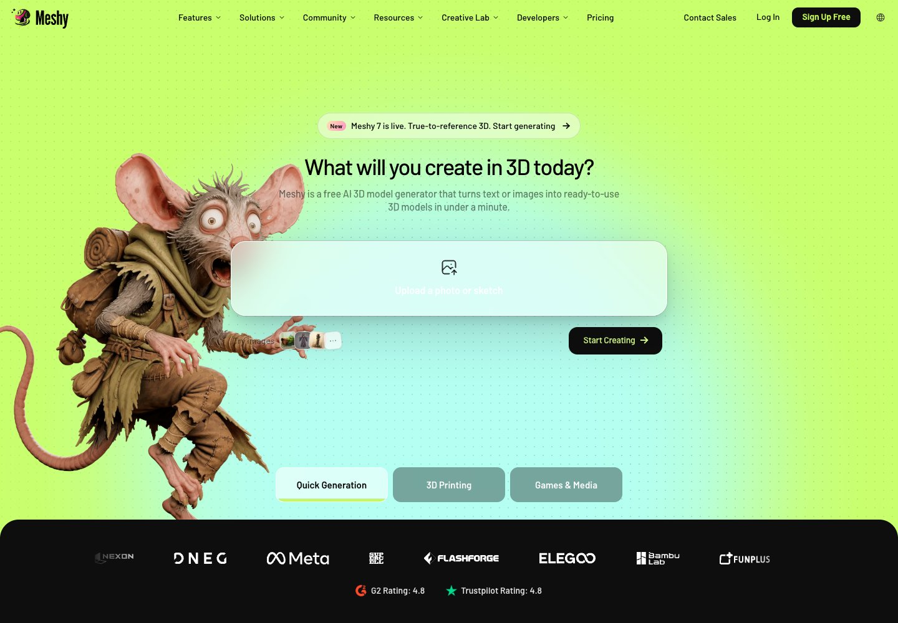](https://www.meshy.ai/)

텍스트·이미지 생성, 텍스처와 리깅. 게임 소품과 출력용 콘셉트 초안에 적합합니다.

[공식 사이트](https://www.meshy.ai/)

### 2. Tripo AI

[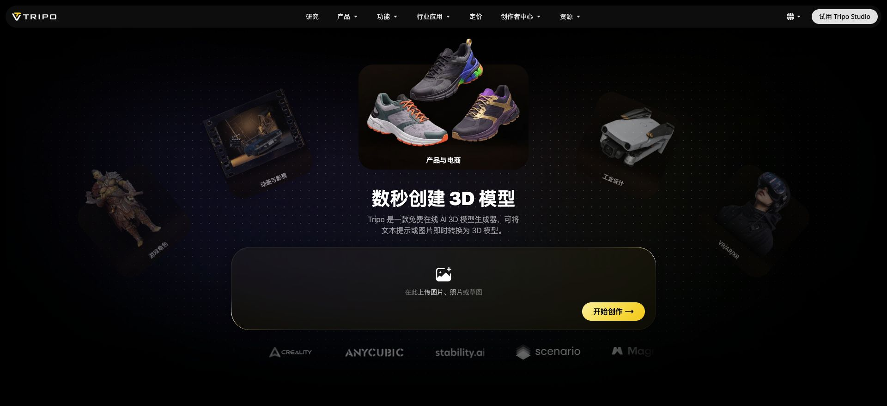](https://www.tripo3d.ai/)

이미지·텍스트 생성과 메시·캐릭터 도구. 캐릭터와 저폴리곤 에셋을 시제품으로 만듭니다.

[공식 사이트](https://www.tripo3d.ai/)

### 3. HeyDream Image to 3D

[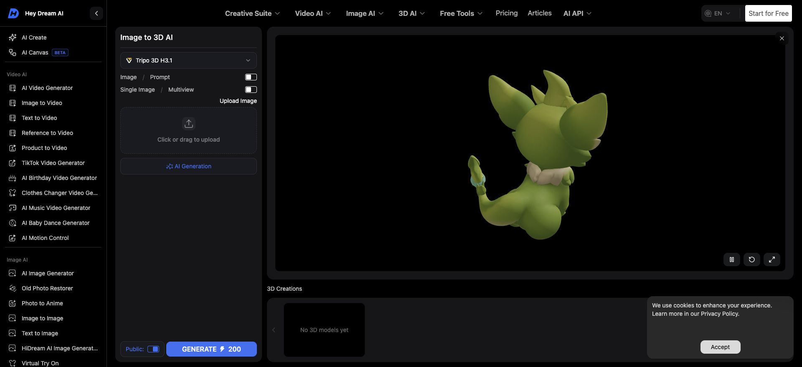](https://heydream.im/image-to-3d/)

단일·다중 시점 입력, AI 참고 이미지와 미리보기. 상품·디자인 초안에 활용하며 확인된 엔진은 Tripo 3D H3.1입니다.

[공식 사이트](https://heydream.im/image-to-3d/)

### 4. See3D

[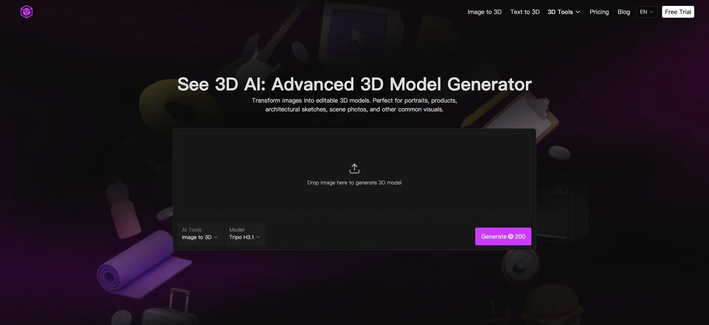](https://see3d.art/)

이미지·텍스트 생성과 온라인 뷰어. 가구·장난감·게임 소품에 활용합니다. 기본 엔진은 Tripo H3.1이며 무료 크레딧이 기본 작업에 부족할 수 있습니다.

[공식 사이트](https://see3d.art/)

### 5. Hyper3D / Rodin

[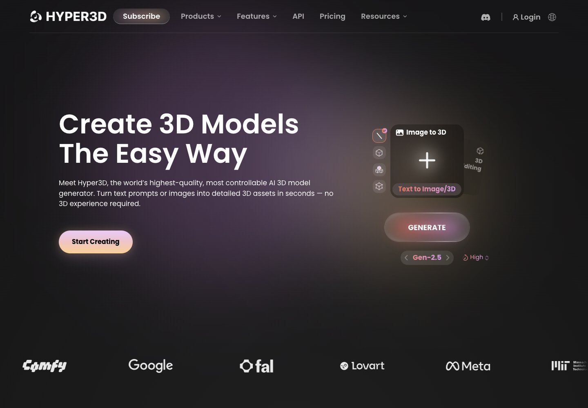](https://hyper3d.ai/)

참고 이미지 기반 생성, 부분 편집과 공간 제어. 장비와 제품 형태를 탐색합니다.

[공식 사이트](https://hyper3d.ai/)

### 6. 3D AI Studio

[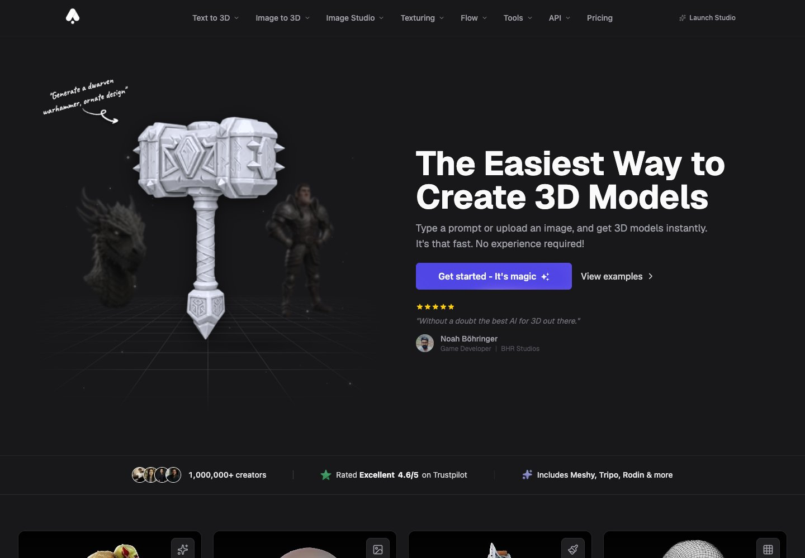](https://www.3daistudio.com/)

여러 엔진과 에셋 처리 작업 공간. 같은 참고 이미지로 결과를 비교합니다.

[공식 사이트](https://www.3daistudio.com/)

### 7. Neural4D

[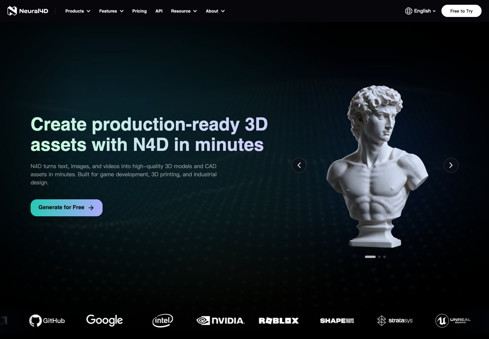](https://www.neural4d.com/)

생성, 텍스처와 캐릭터 도구. 교육용 물체와 출력용 기본 메시를 만듭니다.

[공식 사이트](https://www.neural4d.com/)

### 8. Sloyd

[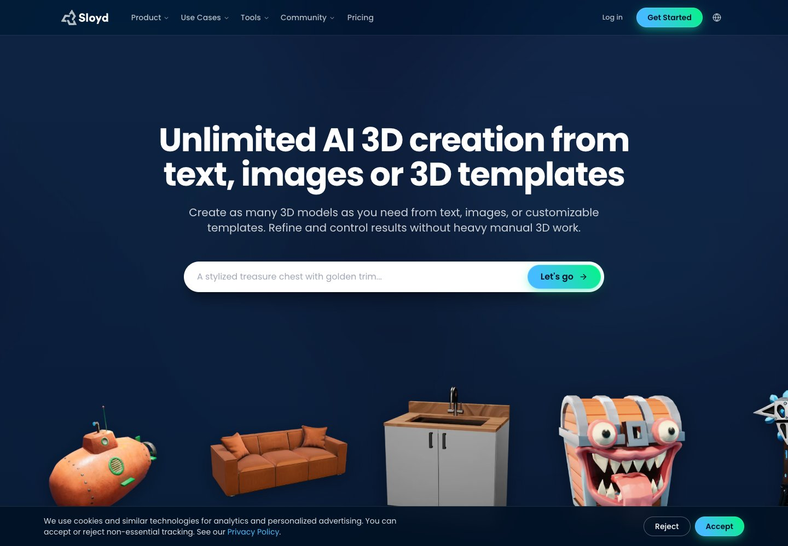](https://www.sloyd.ai/)

AI 생성과 조절 가능한 템플릿. 일관된 가구·소품 변형을 제작합니다.

[공식 사이트](https://www.sloyd.ai/)

### 9. Marble / World Labs

[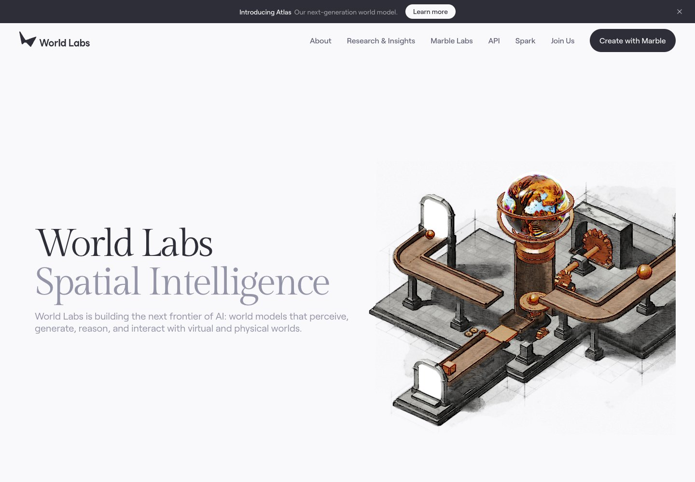](https://www.worldlabs.ai/)

탐색 가능한 세계 생성. 방 배치와 레벨 분위기를 검토합니다.

[공식 사이트](https://www.worldlabs.ai/)

### 10. Seele AI

[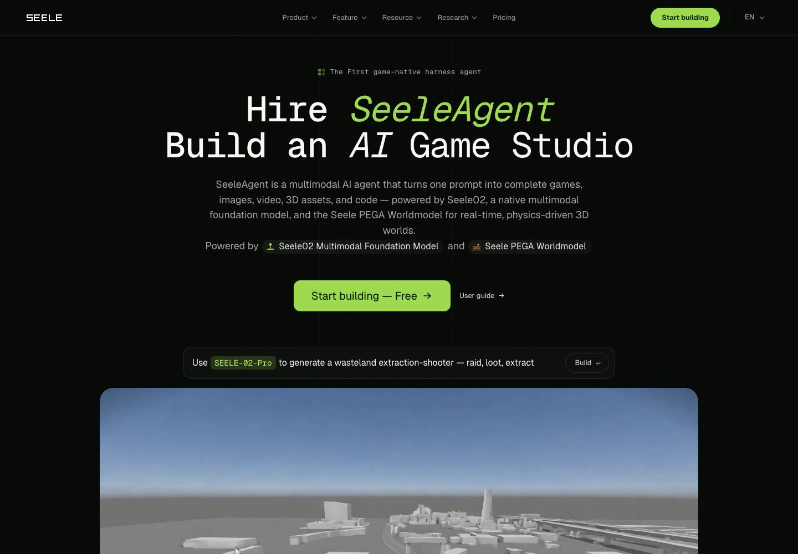](https://www.seeles.ai/)

에셋과 게임 제작 통합. 장면·캐릭터·게임 플레이를 시험합니다.

[공식 사이트](https://www.seeles.ai/)

### 11. Zoo Design Studio

[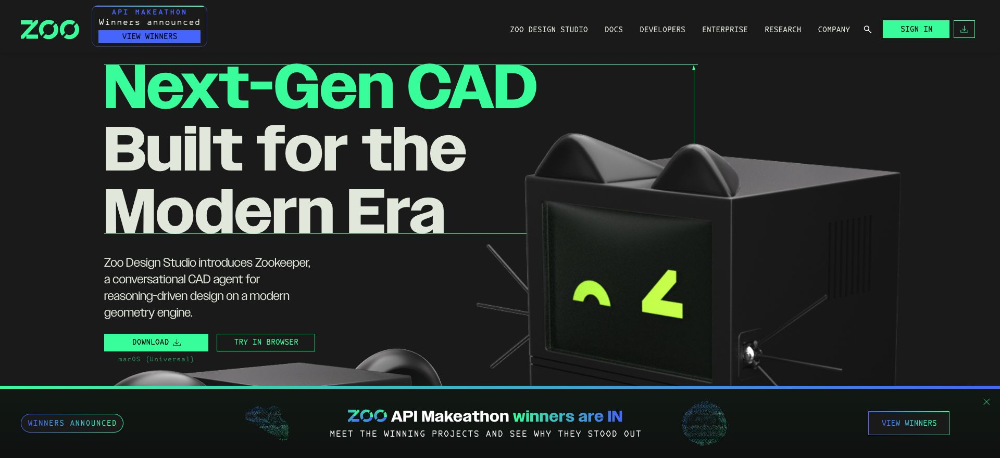](https://zoo.dev/)

편집 가능한 형상의 대화형 CAD. 브래킷·케이스·치수를 검토합니다.

[공식 사이트](https://zoo.dev/)

### 12. Fast3D

[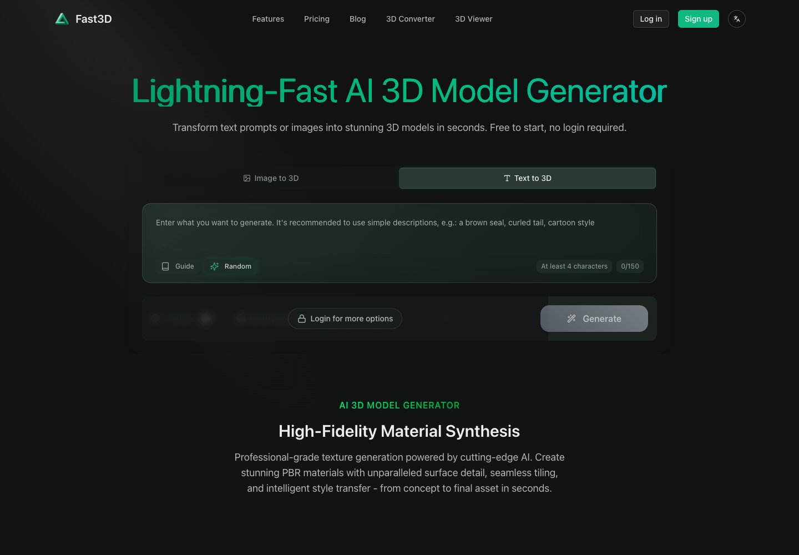](https://fast3d.io/)

빠른 텍스트·이미지 모델링. 간단한 소품·장식품·AR 초안에 활용합니다.

[공식 사이트](https://fast3d.io/)

### 13. Alpha3D

[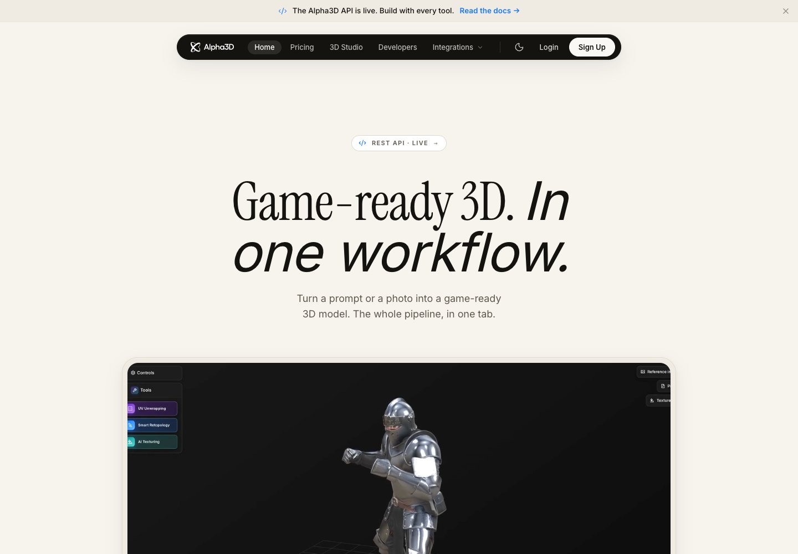](https://www.alpha3d.io/)

생성과 에셋 처리 흐름. 메시·UV·내보내기를 통일합니다.

[공식 사이트](https://www.alpha3d.io/)

### 14. Kaedim

[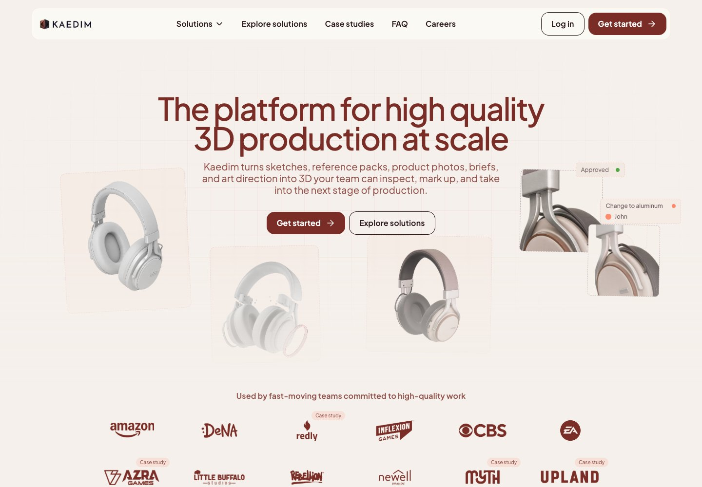](https://www.kaedim3d.com/)

팀용 에셋 제작. 요구사항과 게임 에셋 일괄 검토를 관리합니다.

[공식 사이트](https://www.kaedim3d.com/)

### 15. Masterpiece X / WorldEngen

[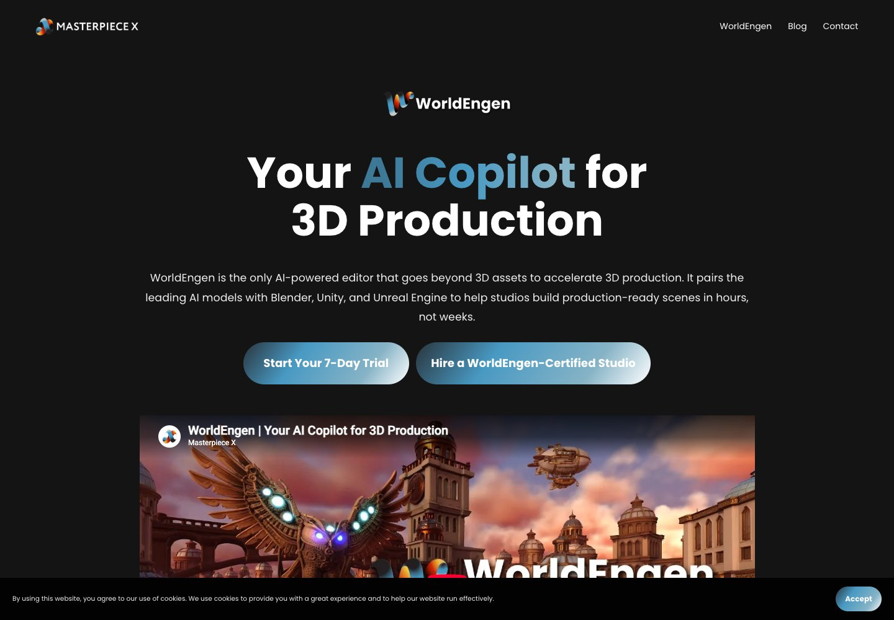](https://www.masterpiecex.com/)

장면 구성과 협업. 환경을 조립하고 제작을 계획합니다.

[공식 사이트](https://www.masterpiecex.com/)

### 16. Spline

[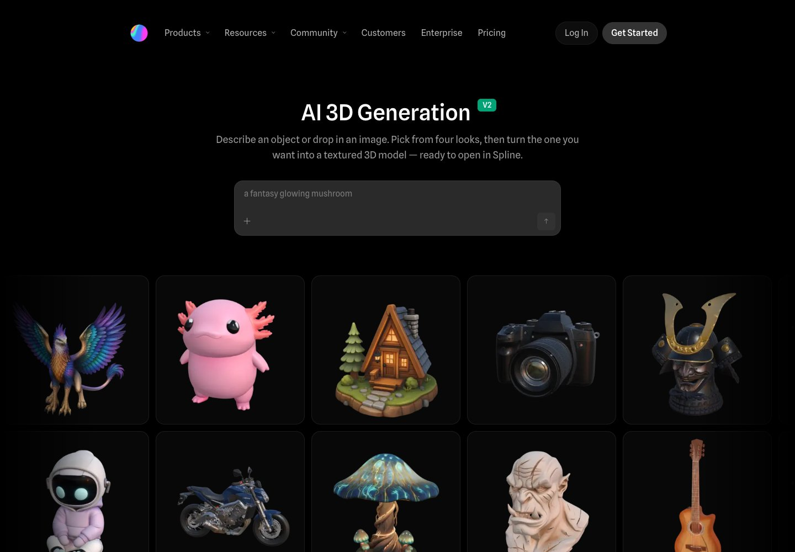](https://spline.design/ai-generate)

인터랙티브 웹 장면과 임베드. 모바일 성능과 로딩을 확인합니다.

[공식 사이트](https://spline.design/ai-generate)

### 17. Tencent Hunyuan3D

[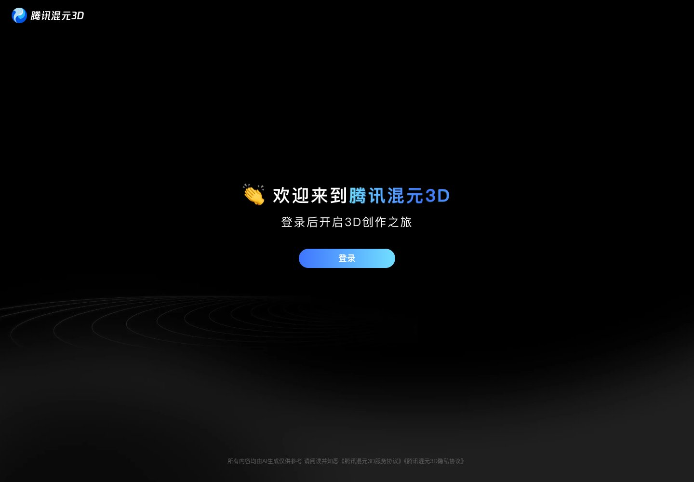](https://3d.hunyuan.tencent.com/)

공개 모델과 추론 흐름. 연구·로컬 배포·맞춤 개발에 활용합니다.

[공식 사이트](https://3d.hunyuan.tencent.com/)

## 작업 순서

게임, 상품 전시, 애니메이션, 출력 중 목적을 정하세요. 선명한 참고 이미지나 물체·형태·재질 설명을 준비하고 초안을 생성합니다. 모든 방향을 검사하고 형상과 텍스처를 수정한 뒤 내보내어 대상 프로그램에서 확인하세요.

## 무료 범위와 결과물

무료 크레딧, 미리보기, 체험판의 조건은 다릅니다. 모델 권한, 다운로드 형식, 상업적 이용 조건을 확인하세요. 뷰어가 읽는 형식과 생성기가 내보내는 형식은 다릅니다. 게임은 토폴로지와 UV, 출력은 밀폐된 형상·벽 두께·치수를 점검하세요. 스크린샷은 공개 페이지와 공식 예시이며 생성 성능 실험이 아닙니다.

## 출처와 관리

[data/traffic.json](data/traffic.json) · [data/screenshots.json](data/screenshots.json)

[중국어 전체 가이드](README_zh.md#sources)

[data/locales.json](data/locales.json) · [scripts/build-readmes.py](scripts/build-readmes.py)
